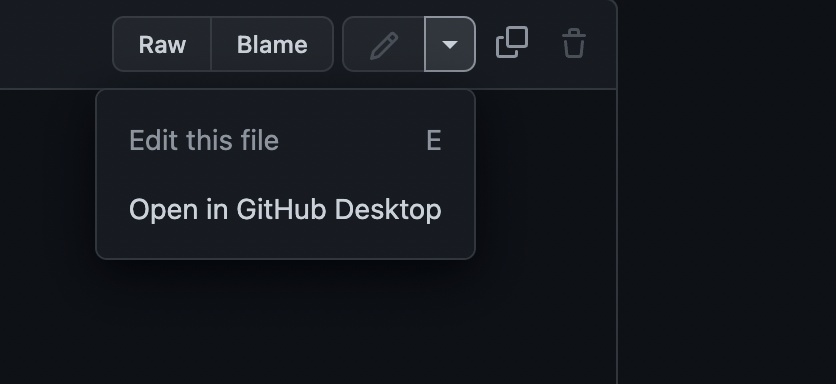
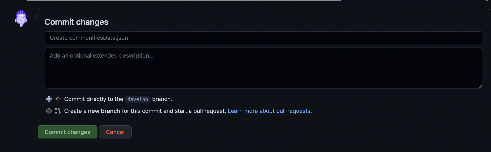

# Come aggiungere una nuova community

Al momento il processo per aggiungere una community non è automatizzato e sarà revisionato da parte del team di SpaghettETH

## Seleziona il file

Il file per aggiungere una community si trova nella cartella `src` ed ha il nome di `communitiesData.json`

Una volta all'interno del file cliccare sull'icona della penna in alto a destra.



e procedere con *Edit this file*

**Edita il file**

Per aggiungere la propria community basta aggiungere una entry al file json personalizzandola con i propri dati.

``` json
{
    "città": "Torino",
    "regione": "piemonte",
    "nome": "ethTurin",
    "membri": 10,
    "meet": "Incontri saltuari in presenza - Incontri saltuari virtuali",
    "format": "Ricerca e Sviluppo - Educazione",
    "focus": "Public Goods & Registries - Smart Contract Programming - NFTs - Legal, Adoption, Regulators",
    "progetti": "ETHTurin2020 - SpaghettETH - On-chain music copyright management Dapp - Crypto Open Mic",
    "twitter": "https://twitter.com/ethturin",
    "github": "https://github.com/ethturin",
    "telegram": "/",
    "discord": "https://discord.gg/GEhgmxkrAZ",
    "website": "ethturin.com",
    "partnership": "Legal Hackers Torino, UniTO",
    "multisig": "eth:0xdF5F3eb665952DAa6De7E520B57BdA322E22D4ba"
  }
  ```
  >esempio di una community

  Copia e incolla (ricordati di separare sul codice la entry precendente con una virgola)


``` json
{
    "città": "",
    "regione": "",
    "nome": "",
    "membri": ,
    "meet": "",
    "format": "",
    "focus": "",
    "progetti": "",
    "twitter": "",
    "github": "",
    "telegram": "",
    "discord": "",
    "website": "",
    "partnership": "",
    "multisig": ""
  }
  ```

  ## Apri una Pull Request

  Una volta editato il file, in fondo alla pagina esegui il *commit* delle modifiche apportate

  

  Nella pagina successiva apri la Pull Request ed il gioco è fatto!

## Nota bene

Prendendo ad esempio la community sopra (non quella vuota) attieniti alle seguenti guidlines
* **regione**: inserisci il nome della regione minuscolo
* **Link e social vari**: inserisci sempre l'URL completo, non il nome del social precedeuto da @ (es: **SI** https://twitter.com/ethturin **NO** @ethturin)
* **Spazi**: Per questioni di stile (e spazio) separa ciò che scrivi con "-" e non tramite "," o ";"
* **buon senso**: sii sintetico e vai dritto al punto.

```
map-website-2022
├─ README.md
├─ index.html
├─ package.json
├─ postcss.config.js
├─ public
│  ├─ favicon.ico
│  └─ logos
│     ├─ cagliariethlab.png
│     ├─ cryptoroma.png
│     ├─ emilano.png
│     ├─ ethbologna.png
│     ├─ ethna.png
│     ├─ ethturin.png
│     ├─ ethvenice.png
│     ├─ leghackma.png
│     ├─ leghackto.png
│     ├─ liminal.png
│     ├─ napuleth.png
│     ├─ sanr3mo.png
│     ├─ urbe.png
│     └─ web3mi.jpg
├─ src
│  ├─ App.vue
│  ├─ assets
│  │  ├─ fonts
│  │  │  └─ Monsterrat
│  │  │     ├─ Montserrat-Black.ttf
│  │  │     ├─ Montserrat-BlackItalic.ttf
│  │  │     ├─ Montserrat-Bold.ttf
│  │  │     ├─ Montserrat-BoldItalic.ttf
│  │  │     ├─ Montserrat-ExtraBold.ttf
│  │  │     ├─ Montserrat-ExtraBoldItalic.ttf
│  │  │     ├─ Montserrat-ExtraLight.ttf
│  │  │     ├─ Montserrat-ExtraLightItalic.ttf
│  │  │     ├─ Montserrat-Italic.ttf
│  │  │     ├─ Montserrat-Light.ttf
│  │  │     ├─ Montserrat-LightItalic.ttf
│  │  │     ├─ Montserrat-Medium.ttf
│  │  │     ├─ Montserrat-MediumItalic.ttf
│  │  │     ├─ Montserrat-Regular.ttf
│  │  │     ├─ Montserrat-SemiBold.ttf
│  │  │     ├─ Montserrat-SemiBoldItalic.ttf
│  │  │     ├─ Montserrat-Thin.ttf
│  │  │     └─ Montserrat-ThinItalic.ttf
│  │  ├─ images
│  │  │  ├─ addCommunity.png
│  │  │  ├─ backIcn.png
│  │  │  ├─ closeIcon.png
│  │  │  ├─ discordIcn.png
│  │  │  ├─ editFile.png
│  │  │  ├─ fork.png
│  │  │  ├─ hamburgerMenuIcon.png
│  │  │  ├─ hoverIcon.png
│  │  │  ├─ linkedinIcn.png
│  │  │  ├─ logoNav.png
│  │  │  ├─ logoNav_no.png
│  │  │  ├─ medium-icon.png
│  │  │  ├─ nextIcn.png
│  │  │  ├─ prevIcn.png
│  │  │  ├─ tapIcon.png
│  │  │  ├─ telegramIcn.png
│  │  │  ├─ tweetterIcn.png
│  │  │  └─ websiteIcn.png
│  │  └─ svg
│  │     ├─ backIcon.svg
│  │     ├─ barchettaDx.svg
│  │     ├─ barchettaSx.svg
│  │     ├─ discordIcon.svg
│  │     ├─ expandIcon.svg
│  │     ├─ fork.svg
│  │     ├─ gitIcon.svg
│  │     ├─ italianMap.svg
│  │     ├─ nextIcon.svg
│  │     ├─ noCommTwo.svg
│  │     ├─ omino_riempibuchi4.svg
│  │     ├─ prevIcon.svg
│  │     ├─ sadCarachter.svg
│  │     ├─ telegramIcon.svg
│  │     ├─ test.svg
│  │     ├─ twitterIcon.svg
│  │     └─ websiteIcon.svg
│  ├─ atoms
│  │  ├─ MenuSlider.vue
│  │  └─ Navbar.vue
│  ├─ communitiesData.json
│  ├─ functions
│  │  └─ useBreakpoint.js
│  ├─ index.css
│  ├─ main.js
│  ├─ molecules
│  │  ├─ CommunitiesCard.vue
│  │  └─ MobileMap.vue
│  ├─ organisms
│  │  └─ Menu.vue
│  ├─ pages
│  │  └─ MapPage.vue
│  ├─ pxToRem.js
│  ├─ theme.js
│  └─ utils
│     └─ useMouseParallax.js
├─ tailwind.config.js
├─ vite.config.js
└─ yarn.lock

```